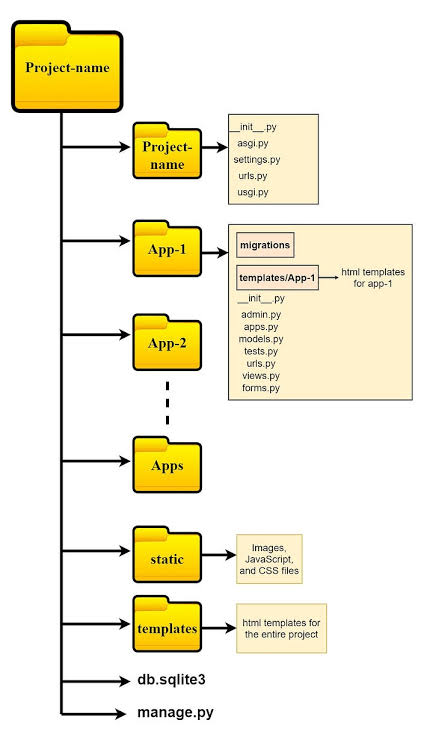

Install & create the project :
cd notes-project
python -m venv venv
source venv/bin/activate          # Windows: venv\Scripts\activate

pip install django djangorestframework django-cors-headers

django-admin startproject config backend
cd backend
python manage.py startapp notes

